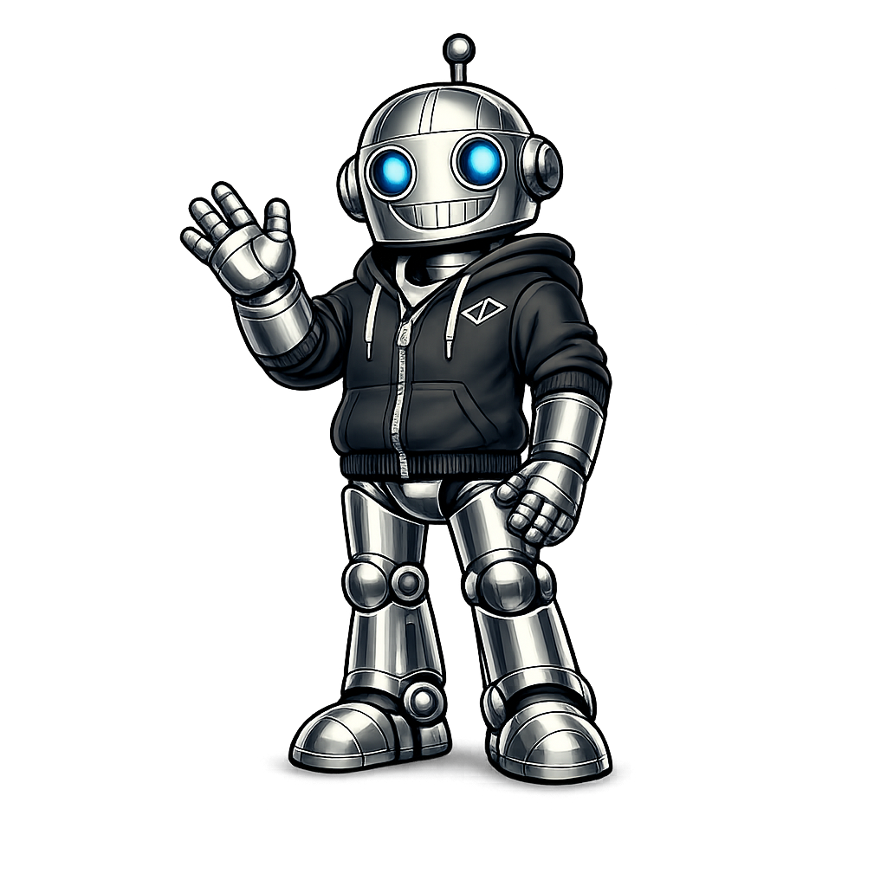

<h1>
    How to Create Your AI Personal Assistant
</h1>

<table>
<tr>

<td>

</td>

<td>
<h2> Step 1: Download this repo </h2>

This project is developed using a virtual environment.
    
If you don't know how to deploy a venv, follow the instructions from

the Jupyter Lab "RunningEnvProjects.ipynb!" located in this repo.

Once your virtual environment is deployed, you can easily run any

project from VSCode, Cursor, or your local Jupyter Installation.

You’ll have a clean, modern, and reproducible environment.

<strong>Tip:</strong>
A virtual environment is your own <em>workspace</em>. You now have: a clean project, 
a clean virtual environment, a modern dependency manager, no manual venv creation,
no pip headaches, and no Python version conflicts.

</td>
</tr>
</table>

<h2>
        Step 1: Install uv
</h2>

Before creating a virtual environment, download and install
<code>uv</code> using the official Astral installer.

Open <strong>PowerShell</strong> and run:

