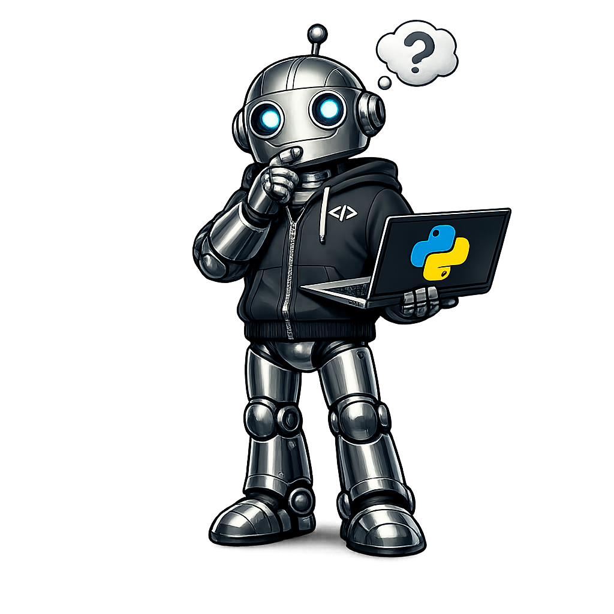

<h1>
    How to Create Your AI Personal Assistant
</h1>
<table>
<tr>

<td>

</td>

<td>
<h2> Step 1: Download this repo </h2>

This project is developed using a virtual environmnent.
    
If you don't know how to deploy a venv, follow the instructioins here!.

You can run the Jypyter Labs using VSCode, Cursor, or your local Jupyter Installation.

<code>uv</code> A venv is fast, simple, and designed for modern Python development.

<strong>Tip:</strong>
Think of a virtual environment as your own <em>workspace</em>, where your project can live without interfering with other Python projects.

</td>
</tr>
</table>

<h2>
        Step 1: Install uv
</h2>

Before creating a virtual environment, download and install
<code>uv</code> using the official Astral installer.

Open <strong>PowerShell</strong> and run:

